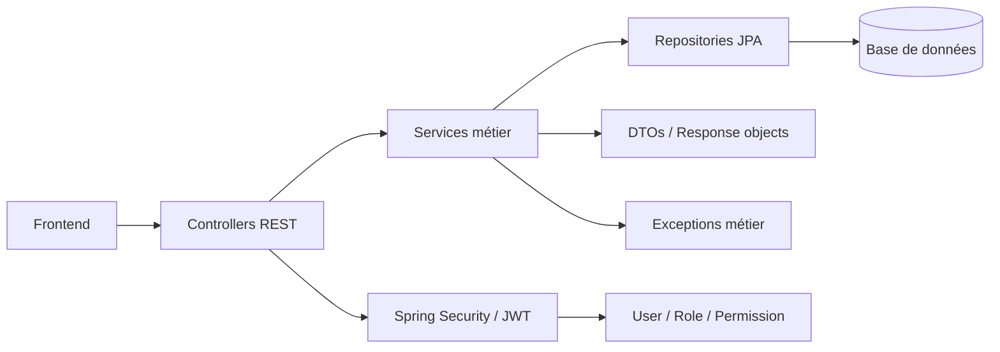

# Analyse du backend StockMaster

Date de référence : 26 juin 2026

## 1. Vue d’ensemble du backend

Le backend est une application Spring Boot 3/4 orientée API REST, avec une architecture en couches classique :

1. Contrôleurs REST pour exposer les endpoints
2. Services métier pour contenir la logique applicative
3. Repositories Spring Data JPA pour l’accès aux données
4. Entités JPA pour représenter le modèle de domaine
5. DTOs pour exposer des objets propres à l’API
6. Composants sécurité (JWT, Spring Security, permissions) pour protéger les routes

### Stack technique observée
- Spring Boot
- Spring Web MVC
- Spring Data JPA
- Spring Security + JWT
- MySQL
- Lombok
- Validation Bean Validation
- Gestion d’exceptions centralisée via @RestControllerAdvice

### Structure générale des packages
- com.backend.module.* : modules métier
- com.backend.security : sécurité JWT et Spring Security
- com.backend.exception : exceptions métier et gestionnaire global
- com.backend.module.shared : entités communes, enums et types partagés

---

## 2. Architecture générale du système

### Flux de traitement type
1. Le frontend envoie une requête HTTP vers un contrôleur.
2. Le contrôleur délègue au service métier correspondant.
3. Le service vérifie les règles métier et accède aux repositories.
4. Les entités sont persistées/modifiées en base.
5. Le service transforme les entités en DTOs pour la réponse.
6. La sécurité contrôle l’accès via JWT et permissions.

### Schéma logique simplifié
```text
Controller -> Service -> Repository -> Entity/DB
    |              |                |
    |              |                +-> autres modules (si dépendance métier)
    |              +-> DTO / validation / exceptions
    +-> Security / JWT / permissions
```

### Composants transverses
- SecurityConfig : configure JWT, CORS, règles d’accès et l’authentification.
- JwtTokenProvider : génère et valide les tokens JWT.
- CustomUserDetailsService : charge l’utilisateur connecté avec son rôle et ses permissions.
- CustomUserDetails : encapsule les privilèges utiles côté sécurité.
- GlobalExceptionHandler : transforme les erreurs en réponses cohérentes.
- BaseEntity : centralise createdAt/updatedAt avec auditeur JPA.

---

## 3. Modules métier implémentés

Les modules actuellement implémentés dans le backend avec logique métier réelle sont :
- auth
- user
- role
- permission
- warehouse
- zone
- category
- product
- supplier
- stock
- purchaseorder
- reception

Des modules complémentaires existent aussi sous forme de modèles/domaines préparés :
- inventory
- inventoryline
- auditreport
- auditsession
- activityreport
- stockmovement
- transfer
- purchaseorderline

---

## 4. Module par module

## 4.1 Authentification et sécurité

### Objectif
Gérer la connexion, la génération du token JWT et la récupération des informations utilisateur courant.

### Architecture par étape
1. Le client appelle /api/auth/login.
2. AuthController transmet la demande à AuthService.
3. AuthService utilise AuthenticationManager pour authentifier le couple username/password.
4. Si l’authentification réussit, un JWT est généré via JwtTokenProvider.
5. Le contexte Spring Security est mis à jour avec l’authentification réussie.
6. Les informations utilisateur sont renvoyées au frontend sous forme de DTO.

### Liens entre fichiers du module
- AuthController : expose les endpoints d’authentification.
- AuthService : orchestre l’authentification et la création de la réponse.
- LoginRequest / LoginResponse / UserInfoResponse : DTOs de transport.
- UserRepository : utilisé pour retrouver l’utilisateur et ses données.
- JwtTokenProvider : produit/valide le token.
- CustomUserDetails : sert de représentation Spring Security de l’utilisateur.

### Fichiers d’autres modules impliqués et pourquoi
- User entity/repository : nécessaire pour charger l’utilisateur à partir des identifiants.
- SecurityConfig : applique la politique de sécurité globale, notamment l’API auth en accès public.
- CustomUserDetailsService : charge les détails utilisateur pour Spring Security.

### Logique implémentée
- Authentification via UsernamePasswordAuthenticationToken.
- Génération de JWT avec expiration configurable.
- Récupération des permissions sous forme d’autorities Spring Security.
- Changement de mot de passe personnel avec réinitialisation du flag mustChangePassword.
- Vérification de permissions via une méthode dédiée.

---

## 4.2 Utilisateurs, rôles et permissions

### Objectif
Centraliser la gestion des comptes utilisateurs, leurs rôles, leurs affectations d’entrepôt et les permissions associées.

### Architecture par étape
1. UserController reçoit les actions liées aux comptes.
2. UserService applique les règles métier et s’appuie sur les repositories.
3. RoleRepository et PermissionSeedService fournissent les rôles et permissions de référence.
4. Les entités User/Role/Permission sont liées en base.
5. CustomUserDetails transforme cette structure en autorités Spring Security.

### Liens entre fichiers du module
- UserController : endpoints CRUD et gestion des affectations.
- UserService : logique métier de création, modification, activation, suppression, assignation de rôle et d’entrepôt.
- UserRepository : accès aux utilisateurs avec filtres, recherche et requêtes spécialisées.
- User entity : représentation du compte utilisateur.
- UserWarehouseHistoryService / Repository : suivi historique des affectations magasiers.
- DTOs : CreateUserRequest, UpdateUserRequest, AssignRoleRequest, AssignWarehouseRequest, UserResponse.

### Fichiers d’autres modules impliqués et pourquoi
- RoleRepository / Role entity : nécessaire pour attribuer un rôle à un utilisateur.
- WarehouseRepository / Warehouse entity : utilisé pour l’affectation des utilisateurs à un entrepôt.
- PermissionSeedService : crée et initialise automatiquement les rôles et permissions au démarrage.
- Security / CustomUserDetails : pour rendre les permissions disponibles pendant l’authentification.

### Logique implémentée
- Création d’utilisateur par l’admin avec rôle libre sauf Administrateur.
- Création de magasinier par le gestionnaire, avec rôle figé à Magasinier et entrepôt imposé.
- Contrôle des doublons de username/email.
- Interdiction de désactiver ou supprimer son propre compte.
- Assignation d’un gestionnaire à un entrepôt avec vérification d’unicité.
- Suppression d’un utilisateur qui gérait un entrepôt : le lien manager est d’abord retiré.
- Historique des affectations magasinier/entrepôt.

---

## 4.3 Rôles et permissions

### Objectif
Définir les permissions métier et les rôles système (Administrateur, Gestionnaire d’entrepôt, Magasinier, Auditeur).

### Architecture par étape
1. PermissionSeedService est déclenché au démarrage de l’application.
2. Il lit le catalogue de permissions défini dans PermissionCatalog.
3. Il crée ou met à jour les Permission en base.
4. Il crée les Role et leur associe les permissions correspondantes.
5. Les permissions sont ensuite utilisées par Spring Security via CustomUserDetails.

### Liens entre fichiers du module
- PermissionSeedService : initialise les permissions et les rôles.
- PermissionCatalog / PermissionDefinition : catalogue central des permissions.
- PermissionRepository : persistance des permissions.
- RoleRepository : persistance des rôles.
- RoleController : expose la liste des rôles actifs.
- Role entity / Permission entity : modèle métier.

### Fichiers d’autres modules impliqués et pourquoi
- UserService et AuthService : utilisent les rôles pour vérifier l’accès et appliquer les règles métier.
- Security / CustomUserDetails : convertit les permissions en authorities Spring Security.

### Logique implémentée
- Les permissions sont semées automatiquement au démarrage.
- Les rôles ont des jeux de permissions différents selon leur fonction.
- Une permission sensible (reset password) est retirée des rôles par défaut.
- L’admin dispose de presque toutes les permissions, le gestionnaire d’un sous-ensemble, le magasinier d’un périmètre réduit.

---

## 4.4 Entrepôts

### Objectif
Gérer les entrepôts, leurs attributs, leur capacité et leur gestionnaire.

### Architecture par étape
1. WarehouseController reçoit les requêtes de lecture/création/modification.
2. WarehouseService applique les règles de validation et de cohérence.
3. WarehouseRepository interagit avec la base.
4. La relation avec User et Zone/Category/Stock est maintenue pour refléter l’organisation réelle.

### Liens entre fichiers du module
- WarehouseController : endpoints CRUD.
- WarehouseService : logique de gestion des entrepôts.
- WarehouseRepository : accès aux entrepôts et requêtes spécialisées.
- Warehouse entity : modèle métier.
- DTOs : CreateWarehouseRequest, UpdateWarehouseRequest, WarehouseResponse.

### Fichiers d’autres modules impliqués et pourquoi
- UserRepository / User entity : pour l’assignation et la désassignation du gestionnaire.
- Zone/Category/Stock : ces modules dépendent directement d’un entrepôt pour leur périmètre métier.

### Logique implémentée
- Vérification d’unicité du nom de l’entrepôt.
- Assignation d’un gestionnaire unique par entrepôt.
- Vérification qu’un gestionnaire ne gère pas déjà un autre entrepôt.
- Mise à jour bidirectionnelle entre Warehouse.manager et User.assignedWarehouse.
- Activation/désactivation de l’entrepôt.
- Gestion de capacité totale et capacité utilisée (mise à jour indirectement par le stock).

---

## 4.5 Zones

### Objectif
Structurer l’espace physique d’un entrepôt en zones et contrôler leur capacité et leur typologie.

### Architecture par étape
1. ZoneController reçoit les requêtes liées aux zones.
2. ZoneService vérifie les droits du demandeur (admin ou gestionnaire).
3. Le service contrôle les règles de périmètre et capacité.
4. La zone est liée à un Warehouse et éventuellement à une Category.
5. La zone participe ensuite à la logique de stockage (module stock).

### Liens entre fichiers du module
- ZoneController : endpoints CRUD et assignation de catégorie.
- ZoneService : logique métier de création, modification et affectation de catégorie.
- ZoneRepository : requêtes sur les zones d’un entrepôt, capacité, coverage de catégories.
- Zone entity : modèle métier.
- DTOs : CreateZoneRequest, UpdateZoneRequest, AssignCategoryRequest, ZoneResponse.

### Fichiers d’autres modules impliqués et pourquoi
- WarehouseRepository : pour vérifier que la zone appartient à l’entrepôt demandé.
- CategoryRepository : pour vérifier la catégorie liée à la zone.
- StockService : la zone sert de lieu de stockage des lignes de stock.

### Logique implémentée
- Les zones sont numérotées séquentiellement dans l’entrepôt.
- Le nom est construit automatiquement selon la séquence et la catégorie.
- La capacité cumulée des zones ne doit pas dépasser la capacité totale de l’entrepôt.
- Les gestionnaires ne peuvent gérer que les zones de leur propre entrepôt.
- Les admins et les gestionnaires n’ont pas exactement le même workflow de création.
- Une catégorie peut être affectée à une zone uniquement si elle appartient à l’entrepôt cible.

---

## 4.6 Catégories

### Objectif
Organiser les produits par catégories et les rattacher à un entrepôt.

### Architecture par étape
1. Le module crée des catégories globales (admin) ou locales (gestionnaire dans un entrepôt).
2. Une catégorie peut ensuite être assignée à un entrepôt.
3. Les produits utilisent cette catégorie comme référentiel logique.
4. Les règles empêchent les suppressions si des produits sont attachés.

### Liens entre fichiers du module
- CategoryController : endpoints de lecture/création/assignation/suppression.
- CategoryService : logique métier autour des catégories.
- CategoryRepository : requêtes sur les catégories, les catégories non assignées, les produits liés.
- Category entity : modèle métier.
- DTOs : CreateCategoryRequest, UpdateCategoryRequest, AssignWarehouseRequest, CategoryResponse.

### Fichiers d’autres modules impliqués et pourquoi
- WarehouseRepository : pour vérifier l’entrepôt cible lors d’une affectation.
- ProductService : les produits dépendent d’une catégorie.
- ZoneService : les zones peuvent être associées à une catégorie.

### Logique implémentée
- Workflow en deux étapes : création globale puis affectation à un entrepôt.
- Les gestionnaires ne peuvent créer des catégories que dans leur propre entrepôt si l’admin n’a pas déjà défini les catégories.
- Les catégories définies par l’admin ne peuvent pas être modifiées/supprimées par le gestionnaire.
- La désaffectation est bloquée si au moins un produit y est rattaché.

---

## 4.7 Produits

### Objectif
Gérer le catalogue produit, les références, les codes-barres et l’affectation aux entrepôts.

### Architecture par étape
1. ProductController reçoit les requêtes de lecture/création/modification.
2. ProductService applique la logique métier.
3. La catégorie est validée et le produit est créé avec une référence et un code-barres auto-générés.
4. L’association aux entrepôts peut être configurée par l’admin.
5. Le produit est ensuite utilisé dans les stocks et commandes.

### Liens entre fichiers du module
- ProductController : endpoints publics/admin/warehouse.
- ProductService : logique métier principale.
- ProductRepository : requêtes filtrées, recherche et accès enrichis.
- Product entity : modèle métier.
- DTOs : CreateProductRequest, UpdateProductRequest, ProductResponse, UpdateProductWarehousesRequest.

### Fichiers d’autres modules impliqués et pourquoi
- CategoryRepository : un produit appartient à une catégorie et cette dernière doit être valide.
- WarehouseRepository : pour l’association produit/entrepôt.
- StockService : le produit est utilisé pour créer des lignes de stock.
- PurchaseOrderService : le produit est présent dans les lignes de commande.

### Logique implémentée
- Génération automatique de référence unique et de code-barres unique.
- Contrôle d’unicité du nom du produit dans une catégorie.
- L’admin peut créer des produits avec un catalogue global.
- Le gestionnaire ne peut créer un produit que si sa catégorie est déjà affectée à son entrepôt.
- La désactivation d’un produit est bloquée si des stocks actifs existent.

---

## 4.8 Fournisseurs

### Objectif
Référencer les fournisseurs externes du système.

### Architecture par étape
1. SupplierController reçoit les requêtes CRUD.
2. SupplierService applique les règles métier simples.
3. SupplierRepository stocke et recherche les fournisseurs.

### Liens entre fichiers du module
- SupplierController : endpoints CRUD.
- SupplierService : logique métier.
- SupplierRepository : accès aux fournisseurs.
- Supplier entity : modèle métier.
- DTOs : CreateSupplierRequest, UpdateSupplierRequest, SupplierResponse.

### Fichiers d’autres modules impliqués et pourquoi
- PurchaseOrderService : un fournisseur est assigné à une commande d’achat.

### Logique implémentée
- Unicité du nom du fournisseur.
- Mise à jour de profil.
- Activation/désactivation logique.

---

## 4.9 Stock et mouvements

### Objectif
Gérer l’état des stocks, les seuils, les mouvements et la capacité utilisée par entrepôt.

### Architecture par étape
1. StockController reçoit les requêtes de lecture et de mise à jour.
2. StockService vérifie la cohérence du stock avec zone, produit et entrepôt.
3. Une création de stock crée également un mouvement d’ajustement si la quantité initiale est positive.
4. Les modifications de stock génèrent de nouveaux mouvements.
5. La capacité utilisée est recalculée à partir du volume des produits en stock.

### Liens entre fichiers du module
- StockController : endpoints de lecture et modification.
- StockService : principale logique métier.
- StockRepository : lecture et requêtes de stock filtrées.
- Stock entity : modèle de ligne de stock.
- StockMovementRepository / StockMovement entity : historisation des mouvements.
- DTOs : CreateStockRequest, UpdateStockRequest, StockResponse.

### Fichiers d’autres modules impliqués et pourquoi
- ProductRepository / Product entity : pour vérifier la nature du produit stocké.
- ZoneRepository / Zone entity : pour contrôler que la zone appartient bien à l’entrepôt.
- WarehouseRepository / Warehouse entity : pour valider l’entrepôt et MAJ de usedCapacity.
- UserRepository : pour tracer l’auteur du mouvement.

### Logique implémentée
- Unicité de la ligne (produit, entrepôt, zone).
- Contrôle de compatibilité entre la catégorie de la zone et celle du produit.
- Génération d’un mouvement d’ajustement à l’initialisation ou au changement de quantité.
- Recalcul de usedCapacity sur la base du volume et de la quantité disponible.
- Détection des niveaux sous seuil (isBelowMin).

---

## 4.10 Commandes d’achat

### Objectif
Gérer le cycle de commande fournisseur : brouillon, validation, livraison, clôture, annulation.

### Architecture par étape
1. PurchaseOrderController reçoit les requêtes de gestion de commande.
2. PurchaseOrderService crée une commande en état DRAFT.
3. Une validation par l’admin associe un fournisseur et change l’état en VALIDATED.
4. Une livraison passe l’état en DELIVERED.
5. La réception de la commande peut ensuite être clôturée puis finalisée.

### Liens entre fichiers du module
- PurchaseOrderController : endpoints de création/validation/livraison/clôture/annulation.
- PurchaseOrderService : logique métier principale.
- PurchaseOrderRepository : accès aux commandes avec filtres.
- PurchaseOrder entity : modèle métier.
- PurchaseOrderLine entity/repository : lignes de commande.
- DTOs : CreatePurchaseOrderRequest, ValidatePurchaseOrderRequest, PurchaseOrderResponse.

### Fichiers d’autres modules impliqués et pourquoi
- SupplierRepository : pour la validation d’un fournisseur actif.
- ProductRepository : pour valider que le produit est bien disponible dans l’entrepôt.
- WarehouseRepository : pour vérifier l’entrepôt de destination.
- ReceptionService : la réception dépend de la commande et de ses lignes.

### Logique implémentée
- Génération automatique d’un numéro de commande.
- Vérification que les produits cités sont disponibles dans l’entrepôt cible.
- Transition d’état strictement contrôlée.
- Annulation interdite si la commande est déjà livrée ou clôturée.

---

## 4.11 Réception de marchandises

### Objectif
Créer et valider un bon de réception à partir d’une commande livrée.

### Architecture par étape
1. ReceptionController reçoit la demande de bon de réception.
2. ReceptionService vérifie la commande et la cohérence des lignes.
3. Le bon est créé en état PENDING.
4. En validation, chaque ligne met à jour le stock et génère un mouvement d’entrée.
5. La commande associée passe ensuite en CLOSED et le bon en VALIDATED.

### Liens entre fichiers du module
- ReceptionController : endpoints de création, validation, rejet.
- ReceptionService : logique métier principale.
- ReceptionRepository : accès au bon de réception.
- Reception entity / ReceptionLine : modèle de réception et ses lignes.
- DTOs : CreateReceptionRequest, RejectReceptionRequest, ReceptionResponse.

### Fichiers d’autres modules impliqués et pourquoi
- PurchaseOrderRepository / PurchaseOrderLineRepository : pour valider la commande et ses lignes.
- StockRepository / StockMovementRepository : pour mettre à jour les stocks et tracer les mouvements.
- ZoneRepository : pour déterminer la zone de réception.
- WarehouseRepository : pour vérifier l’entrepôt.
- UserRepository : pour tracer le validateur.

### Logique implémentée
- Une réception PENDING ne peut pas coexister avec une autre réception déjà en attente pour la même commande.
- La validation augmente la quantité disponible en stock et crée des StockMovement de type ENTRY.
- Le bon peut être rejeté et la commande repasse en état DELIVERED pour une nouvelle réception.
- Les écarts sont calculés sur les lignes réceptionnées.

---

## 5. Modules de support et modèles préparés

Certains modules existent déjà sous forme de modèles et d’enums, mais leur logique métier n’est pas encore complètement exposée via contrôleurs et services propres.

### Modules observés
- inventory / inventoryline : modèle de comptage et lignes de comptage
- auditreport / auditsession : logique d’audit et rapport
- activityreport : rapports d’activité utilisateur
- stockmovement : journal des mouvements de stock
- transfer : logique de transfert interne
- purchaseorderline : lignes de commande

### Rôle de ces modules
- Ils complètent le modèle fonctionnel de la solution.
- Ils sont préparés pour des workflows plus avancés : inventaires, audits, transferts, traçabilité.
- Certains d’entre eux sont déjà impliqués par des services existants (par exemple stockmovement utilisé par stock et réception).

---

## 6. Diagramme d’architecture



### Cartographie rapide module → couche logique
- Auth : Controller → AuthService → UserRepository + JwtTokenProvider
- User : Controller → UserService → UserRepository + RoleRepository + WarehouseRepository
- Warehouse : Controller → WarehouseService → WarehouseRepository + UserRepository
- Zone : Controller → ZoneService → ZoneRepository + CategoryRepository + WarehouseRepository
- Category : Controller → CategoryService → CategoryRepository + WarehouseRepository
- Product : Controller → ProductService → ProductRepository + CategoryRepository + WarehouseRepository
- Supplier : Controller → SupplierService → SupplierRepository
- Stock : Controller → StockService → StockRepository + StockMovementRepository + ZoneRepository + ProductRepository
- PurchaseOrder : Controller → PurchaseOrderService → PurchaseOrderRepository + PurchaseOrderLineRepository + SupplierRepository + ProductRepository
- Reception : Controller → ReceptionService → ReceptionRepository + PurchaseOrderRepository + StockRepository + StockMovementRepository

---

## 7. Cartographie des endpoints REST

### Authentification
- POST /api/auth/login : connexion et génération du cookie JWT
- POST /api/auth/logout : suppression du cookie JWT
- GET /api/auth/me : informations utilisateur courant
- POST /api/auth/change-password : changement de mot de passe
- GET /api/auth/check : vérification d’authentification

### Utilisateurs
- GET /api/users : liste paginée des utilisateurs
- GET /api/users/storekeeper-list : liste des magasiniers d’un entrepôt
- GET /api/users/available-managers : gestionnaires disponibles pour assignation
- GET /api/users/tree : arbre hiérarchique entrepôts/utilisateurs
- GET /api/users/{id} : détail d’un utilisateur
- POST /api/users : création d’un utilisateur
- POST /api/users/storekeeper : création d’un magasinier
- PUT /api/users/{id} : mise à jour utilisateur
- PATCH /api/users/{id}/toggle : activation/désactivation
- PATCH /api/users/{id}/toggle-storekeeper : activation/désactivation magasinier
- PATCH /api/users/{id}/reset-password : réinitialisation du mot de passe
- DELETE /api/users/{id} : suppression utilisateur
- PATCH /api/users/{id}/role : assignation de rôle
- PATCH /api/users/{id}/warehouse : assignation d’entrepôt

### Entrepôts
- GET /api/warehouses : liste paginée des entrepôts
- GET /api/warehouses/unassigned : entrepôts sans gestionnaire
- GET /api/warehouses/{id} : détail d’un entrepôt
- POST /api/warehouses : création d’un entrepôt
- PUT /api/warehouses/{id} : modification d’un entrepôt
- PATCH /api/warehouses/{id}/toggle : activation/désactivation

### Zones
- GET /api/warehouses/{warehouseId}/zones : zones d’un entrepôt
- POST /api/warehouses/{warehouseId}/zones : création d’une zone
- PATCH /api/warehouses/{warehouseId}/zones/{zoneId}/assign-category : assignation de catégorie
- PUT /api/warehouses/{warehouseId}/zones/{zoneId} : modification d’une zone
- GET /api/warehouses/{warehouseId}/zones/covered-categories : catégories déjà couvertes par l’admin

### Catégories
- GET /api/categories : catégories globales (admin)
- GET /api/categories/unassigned : catégories non affectées
- POST /api/categories : création globale
- PUT /api/categories/{id} : modification
- DELETE /api/categories/{id} : suppression
- PATCH /api/categories/{id}/assign : affectation à un entrepôt
- GET /api/warehouses/{warehouseId}/categories : catégories d’un entrepôt
- POST /api/warehouses/{warehouseId}/categories : création locale pour un entrepôt
- DELETE /api/warehouses/{warehouseId}/categories/{id} : désaffectation

### Produits
- GET /api/products : catalogue global
- GET /api/products/warehouses-by-category : entrepôts concernés par une catégorie
- GET /api/products/{id} : détail d’un produit
- POST /api/products : création globale
- PUT /api/products/{id} : modification
- PATCH /api/products/{id}/toggle : activation/désactivation
- PUT /api/products/{id}/warehouses : affectation aux entrepôts
- GET /api/warehouses/{warehouseId}/products : produits d’un entrepôt
- POST /api/warehouses/{warehouseId}/products : création locale dans un entrepôt
- GET /api/warehouses/{warehouseId}/products/select : liste plate pour les selects

### Fournisseurs
- GET /api/suppliers : liste des fournisseurs
- GET /api/suppliers/{id} : détail
- POST /api/suppliers : création
- PUT /api/suppliers/{id} : modification
- PATCH /api/suppliers/{id}/toggle : activation/désactivation

### Stock
- GET /api/warehouses/{warehouseId}/stocks : stock par entrepôt
- POST /api/warehouses/{warehouseId}/stocks : création d’une ligne de stock
- PUT /api/warehouses/{warehouseId}/stocks/{stockId} : mise à jour du stock
- GET /api/warehouses/{warehouseId}/stocks/movements : historique des mouvements

### Commandes d’achat
- GET /api/warehouses/{warehouseId}/purchase-orders : commandes d’un entrepôt
- GET /api/warehouses/{warehouseId}/purchase-orders/{orderId} : détail d’une commande
- POST /api/warehouses/{warehouseId}/purchase-orders : création d’une commande
- PATCH /api/warehouses/{warehouseId}/purchase-orders/{orderId}/validate : validation
- PATCH /api/warehouses/{warehouseId}/purchase-orders/{orderId}/deliver : livraison
- PATCH /api/warehouses/{warehouseId}/purchase-orders/{orderId}/close : clôture
- PATCH /api/warehouses/{warehouseId}/purchase-orders/{orderId}/cancel : annulation
- GET /api/purchase-orders : vue admin globale
- GET /api/purchase-orders/by-supplier/{supplierId} : historique d’un fournisseur

### Réception
- GET /api/warehouses/{warehouseId}/receptions : bons de réception
- GET /api/warehouses/{warehouseId}/receptions/deliverable : commandes livrées disponibles
- GET /api/warehouses/{warehouseId}/receptions/pending-count : compteur de validations en attente
- GET /api/warehouses/{warehouseId}/receptions/{receptionId} : détail
- POST /api/warehouses/{warehouseId}/receptions : création d’un bon de réception
- PATCH /api/warehouses/{warehouseId}/receptions/{receptionId}/validate : validation
- PATCH /api/warehouses/{warehouseId}/receptions/{receptionId}/reject : rejet

---

## 8. Points forts de l’architecture actuelle

- Séparation claire en couches.
- Encapsulation de la logique métier dans les services.
- Contrôle d’accès basé sur JWT et permissions.
- Règles métier fortes autour des transitions d’état et des contraintes de périmètre.
- Utilisation de DTOs pour protéger le modèle et simplifier l’API.
- Gestion centralisée des erreurs.

---

## 9. Points de vigilance / zones d’évolution

- Certains modules sont présents sous forme d’entités mais n’ont pas encore de services complètes.
- La logique métier est parfois dispersée entre les services et les repositories, ce qui peut évoluer vers une couche de domaine plus explicite.
- La traçabilité et l’audit pourraient être renforcés via un service transversal dédié.
- Une couche de mapping plus explicite entre entités et DTOs pourrait améliorer la maintenabilité.

---

## 10. Conclusion

Le backend est déjà structuré autour d’un noyau métier robuste pour la gestion d’entrepôts, du stock, des produits, des commandes et des réceptions. La logique est majoritairement implémentée dans des services métier, avec des règles métiers cohérentes et un découpage modulaire clair. Les modules de sécurité, utilisateur, référentiel et flux opérationnels sont déjà suffisants pour couvrir un cœur fonctionnel complet de gestion logistique.
